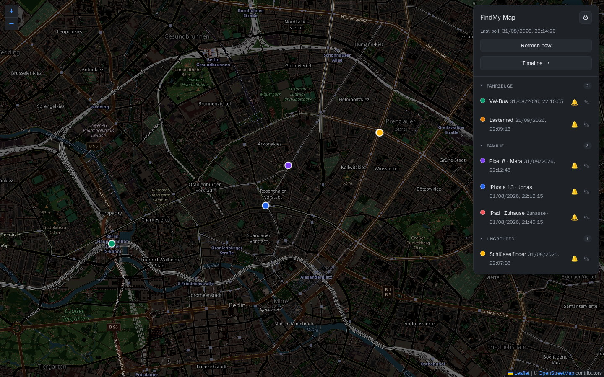
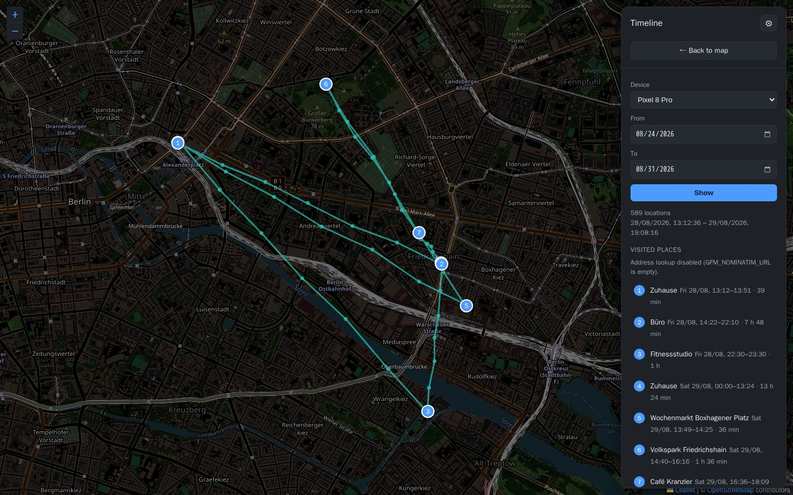
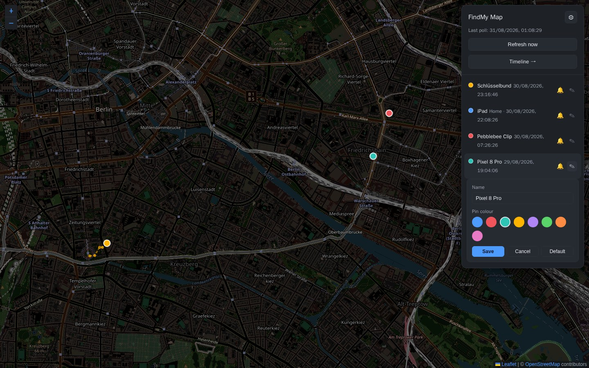
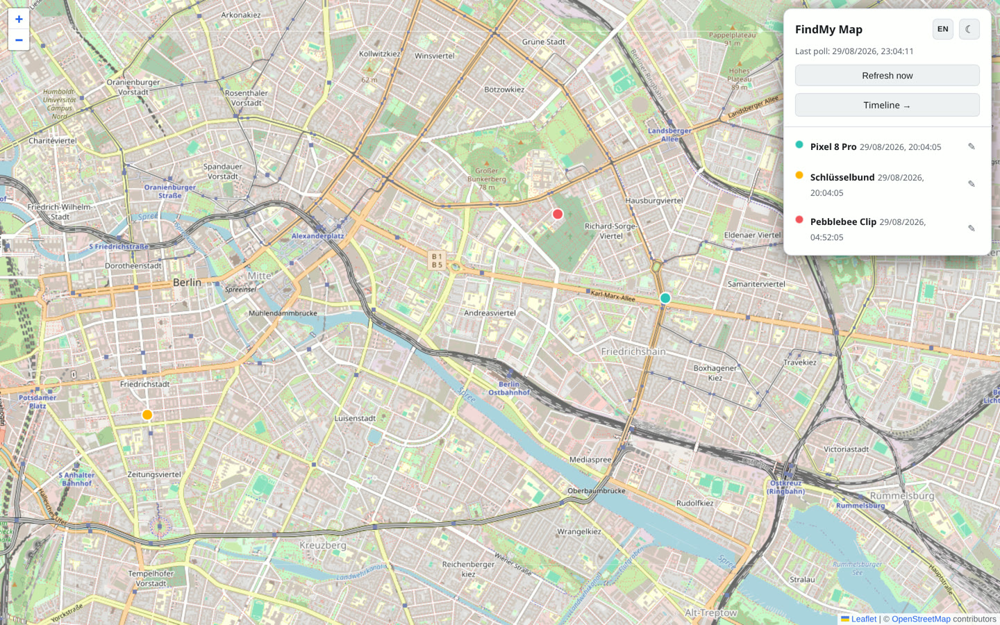
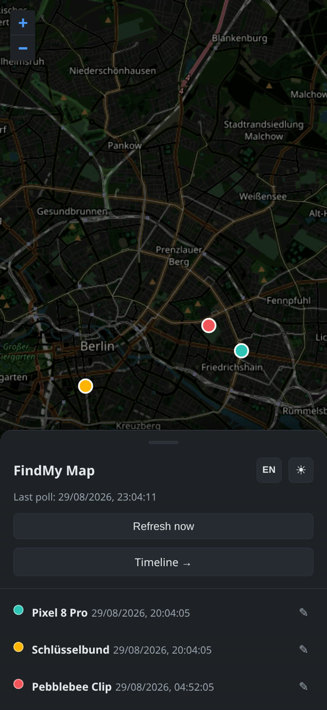
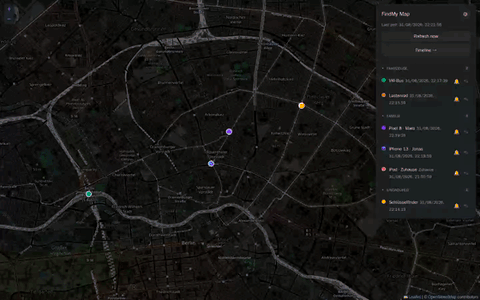

# findmy-map

Shows the locations of the devices registered with Google "Find My Device"
(phone, ESP32 tracker, …) on a real map (Leaflet + OpenStreetMap) instead of
just a Google Maps link in the terminal. On top of that: a history track for a
chosen time range and a text-oriented list of visited places (similar to the
Google Timeline).

The service builds on the
[`leonboe1/GoogleFindMyTools`](https://github.com/leonboe1/GoogleFindMyTools)
library and is meant to run as an **add-on container next to an already
configured GoogleFindMyTools container**: it shares that container's
`Auth/secrets.json`, so **no separate login is required**.

> This project is not affiliated with Google or Apple. Use at your own risk and
> only for devices/accounts you are authorised to access.

## Screenshots



<table>
<tr>
<td width="50%"></td>
<td width="50%"></td>
</tr>
<tr>
<td></td>
<td align="center"></td>
</tr>
</table>



<sub>All screenshots use synthetic demo data (fictional devices moving around Berlin), not real location history.</sub>

## Requirements

- An already **logged-in** GoogleFindMyTools container; its
  `Auth/secrets.json` exists and holds valid tokens.

## Setup

Grab only `docker-compose.yml` and `.env.example` — the image is pulled from
GHCR, no clone or local build needed:

```bash
mkdir google-findmy-map && cd google-findmy-map
curl -O https://raw.githubusercontent.com/EXxT4ZzY/google-findmy-map/main/docker-compose.yml
curl -o .env https://raw.githubusercontent.com/EXxT4ZzY/google-findmy-map/main/.env.example
# edit .env: GFM_SECRETS_FILE, GFM_DATA_DIR, PUID/PGID, PROXY_NETWORK
docker compose up -d
```

To build from source instead, clone the repo and flip `image:` back to
`build: .` in `docker-compose.yml`, then `docker compose up -d --build`.

Key `.env` values:

| Variable | Meaning |
|---|---|
| `GFM_SECRETS_FILE` | Host path to the **single** `secrets.json` of the existing GoogleFindMyTools container. Bind-mounted read-write so token refreshes stay in sync between both containers. Do **not** mount the whole `Auth/` folder — only this one file. |
| `GFM_DATA_DIR` | Host directory for this service's SQLite database (`history.db`). Holds raw location data — treat it as personal data. |
| `PUID` / `PGID` | Owner of the two paths above (and the UID the container runs as). Check with `stat -c '%u:%g' "$GFM_SECRETS_FILE"`. An init step chowns `GFM_DATA_DIR` to match. |
| `PROXY_NETWORK` | Name of the external Docker network your reverse proxy is on. |

All other (optional) variables are documented in `.env.example`.

## Web UI

- **Light/dark toggle** (☀/☾ in the header of both pages), remembered in the
  browser. In dark mode the OSM tiles are darkened via a CSS filter (building
  outlines / streets / labels stay intact); no API key.
- **Language toggle** (EN/DE in the header), also remembered in the browser.
- The map fills the screen; the device list sits on top as a **floating panel**
  (top right on desktop, sized to its content; a collapsible bottom sheet on
  narrow screens). Sorted by most recent location; clicking a row centres the
  map.
- Each device has its own pin colour; the last 5 positions are joined by a
  line.
- **Edit devices:** the ✎ button on each row → change the display name, pick a
  pin colour from a palette, and put the device in a **group** (free text,
  with suggestions from the groups already in use). **Default** clears all
  three.
- **Groups:** once any device has a group, the list is split into collapsible
  sections ("Familie", "Fahrzeuge", …) with an "Ungrouped" section at the
  bottom. Collapsing a group also hides its pins from the map — collapsed
  state is remembered per browser. The timeline's device picker groups the
  same way (`<optgroup>`).
- **Old devices:** the settings page lists devices that no longer appear in
  the poll (still in the timeline picker, gone from the map) and lets you
  delete one — its whole history and its overrides. The delete is keyed on
  the device id, never the name, and the confirm step shows the full id, so
  two devices you happened to rename to the same name stay distinguishable;
  a device that is still live cannot be deleted.
- **Ring a device:** the 🔔 button on each row makes it play its "find my
  device" sound; tap again (or wait ~30 s) to stop. The button shakes the
  instant the tap registers — there's a real multi-second FCM round-trip
  before the phone actually rings, so that feedback can't wait on the
  network.
- A device whose last report is a **semantic location** (a named place
  without coordinates, e.g. "Home") gets no map pin — Google's API doesn't
  send coordinates for those — but the place name is shown in the device
  list instead of being silently dropped.
- **Polling-failure banner:** a red bar across the top of the map and
  timeline pages once polling has failed `GFM_POLL_ALERT_AFTER` times in a
  row (default 3 — an expired `secrets.json`, an upstream break), so you
  find out without opening the app to check. It clears itself when polling
  recovers. `GET /api/health` exposes the same state for an external
  uptime monitor.
- **Timeline** (`timeline.html`): pick a device, then step through by
  **Day / Week / Month** with the ‹ › arrows (or pick a free **Range**) →
  the full track as a line, plus a **list of visited places** (address,
  arrival–departure, duration) with numbered markers. A visit is only
  formed when the stored history actually contains several reports from
  *one* place (radius `GFM_VISIT_RADIUS_M`) spanning at least
  `GFM_VISIT_MIN_MINUTES` — with a still sparse history a note is shown,
  and it fills in over time. Long visit lists are capped with a "show
  more" button so the export controls below stay reachable. The device
  picker lists every device ever seen, not just ones in the current poll;
  the chosen view mode + date are remembered per browser.
- **Export:** the timeline offers **GPX / GeoJSON / CSV** downloads of the
  track and of the visited places for the chosen device and date range; the
  settings page has a per-device **full-history** export. For backup, or for
  QGIS / Google Earth / a script.

### Authentication

Optional and **off by default**. Open the settings page (the ⚙ icon in the
header), tick **Require login** and set a username and a password (min. 8
characters) — both are required the first time you enable it. From then on
every page and API call needs the session cookie from the login page. The
same settings page changes the username, the password, or turns auth off
again (all three ask for the current password).

If you lock yourself out — forgotten username or password — set
`GFM_AUTH_DISABLE=1` and restart — auth is forced off so you can reset it.
With auth enabled you can expose the service directly, but **only over
HTTPS** (see `SECURITY.md`).

## How it works

- `Dockerfile` clones `GoogleFindMyTools` (commit pinned via
  `ARG GFM_UPSTREAM_REF`) into `/app/vendor`.
- `docker-compose.yml` mounts only the single `secrets.json` into the vendored
  `Auth` folder — login data / token refresh shared rather than duplicated,
  without overwriting the rest of the vendored auth code. A `findmy-map-init`
  step (Alpine, root) chowns the data volume to `PUID:PGID` and exits.
- `service/locations.py` uses the library functions but returns structured
  data instead of only printing it.
- `service/main.py` — FastAPI + a background poll thread. Endpoints:
  `GET /api/locations` (incl. `palette` and `poll_alert`), `GET /api/health`
  (public liveness probe — `{ok, poll_alert, last_poll, …}`, no error
  detail), `GET /api/devices` (every device ever seen, for the timeline
  picker, with a `live` flag and `point_count`), `GET /api/history`,
  `GET /api/visits`, `GET /api/export/history` and `GET /api/export/visits`
  (`?format=gpx|geojson|csv`, optional `start`/`end`), `POST /api/refresh`,
  `PUT /api/devices/{id}`, `DELETE /api/devices/{id}` (stale devices only —
  409 while live), `POST /api/devices/{id}/ring[/stop]`. The mutating
  endpoints reject cross-site requests (Fetch Metadata).
- `service/export.py` — the GPX / GeoJSON / CSV formatters (stdlib only).
- `service/store.py` — SQLite: full history (`add`/`recent`/`range` + a
  one-time `history.json` migration), device overrides (name / colour /
  group), geocode cache. New columns are added to an existing DB on
  startup (`_migrate_schema`).
- `service/colors.py` (pin colour, with validation), `service/augment.py`
  (track/name/colour per device), `service/visits.py` (clusters points into
  stays), `service/geocode.py` (reverse geocoding via Nominatim, ≤ 1
  request/1.1 s, negative cache + backoff).
- `web/index.html`, `web/timeline.html`, `web/app.css`, `web/app.js`.

## Environment variables

See `.env.example`. Summary:

| Variable | Default | Purpose |
|---|---|---|
| `GFM_POLL_INTERVAL_SECONDS` | `120` | Poll interval |
| `GFM_HISTORY_DB` | `/data/history.db` | SQLite DB (full history + settings + geocode cache) |
| `GFM_HISTORY_FILE` | `/data/history.json` | only for a one-time migration from an earlier version |
| `GFM_DEVICE_COLORS` | – | JSON `{id-or-name: hex/keyword}`. Priority: UI colour → env → palette |
| `GFM_NOMINATIM_URL` | public OSM Nominatim | reverse geocoding; **empty = off** |
| `GFM_GEOCODE_EMAIL` | – | contact email sent as the `email=` parameter (OSM policy) |
| `GFM_VISIT_RADIUS_M` / `GFM_VISIT_MIN_MINUTES` | `100` / `15` | definition of a "visited place" |
| `GFM_HISTORY_RETENTION_DAYS` | – | delete location fixes older than this many days; **empty = keep forever** (unchanged default) |
| `GFM_POLL_ALERT_AFTER` | `3` | show the "updates are failing" banner after this many failed poll cycles in a row; `0` disables it |
| `GFM_AUTH_DISABLE` | – | `1` forces the optional login off (recovery from a lost password) |
| `GFM_LOGIN_DELAY_MS` | `500` | fixed delay per login attempt |

## Known limitations

- The location history grows unbounded unless you opt into
  `GFM_HISTORY_RETENTION_DAYS` — it defaults to off, so an upgrade never
  starts silently deleting data an existing install never asked to lose.
- "Semantic locations" (named places without coordinates, e.g. "Home") never
  get a map pin — Google's API sends no coordinates for them, so there is
  nothing to place on the map. The name is shown in the device list instead.
- On an owner-key version change, `secrets.json` must be regenerated in the
  existing container.
- `secrets.json` is written non-atomically by both containers; a conflict on an
  exactly simultaneous token refresh is theoretically possible, in practice
  unlikely.

## License

[MIT](LICENSE)
